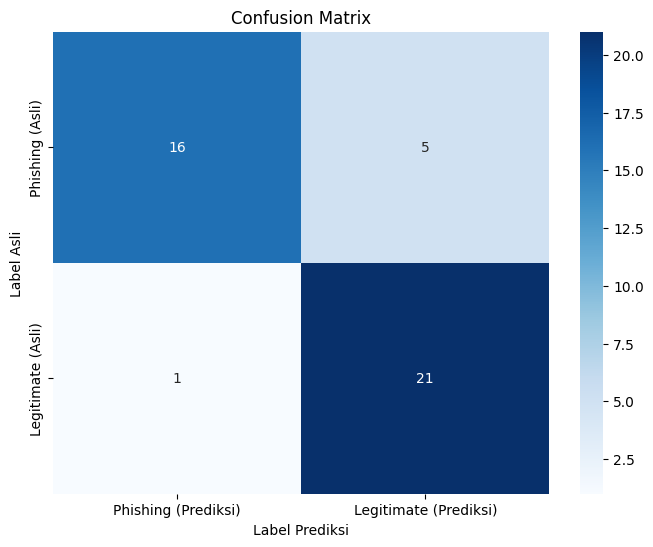
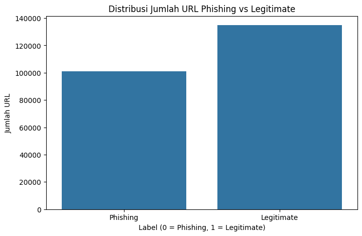

# Deteksi URL Phishing dan Ekstraksi Pola Ancaman dengan IBM Granite


Proyek ini mendemonstrasikan bagaimana Large Language Model (LLM) modern, khususnya IBM Granite 8B Instruct, dapat dimanfaatkan tidak hanya untuk tugas klasifikasi biner tetapi juga untuk ekstraksi insight kualitatif pada kasus deteksi URL phishing.

- **Dataset**: [PhiUSIIL Phishing URL Dataset](https://www.kaggle.com/datasets/ndarvind/phiusiil-phishing-url-dataset/data)

---

## Daftar Isi

- [Deteksi URL Phishing dan Ekstraksi Pola Ancaman dengan IBM Granite](#deteksi-url-phishing-dan-ekstraksi-pola-ancaman-dengan-ibm-granite)
  - [Daftar Isi](#daftar-isi)
  - [Fitur Utama](#fitur-utama)
  - [Tumpukan Teknologi (Tech Stack)](#tumpukan-teknologi-tech-stack)
  - [Instalasi \& Setup](#instalasi--setup)
  - [Cara Menjalankan](#cara-menjalankan)
  - [Hasil Analisis](#hasil-analisis)
    - [Performa Klasifikasi](#performa-klasifikasi)
    - [Insight yang Dihasilkan oleh AI](#insight-yang-dihasilkan-oleh-ai)
    - [Validasi Insight dengan Data](#validasi-insight-dengan-data)
  - [Kesimpulan](#kesimpulan)
  - [Pengembangan di Masa Depan](#pengembangan-di-masa-depan)
    - [Penulis](#penulis)

---

## Fitur Utama

- **Klasifikasi URL**: Mengklasifikasikan URL sebagai `Phishing` atau `Legitimate` dengan akurasi tinggi.
- **AI sebagai Analis**: Menggunakan LLM untuk menganalisis dan meringkas taktik-taktik umum yang ditemukan pada URL berbahaya.
- **Validasi Kuantitatif**: Membuktikan temuan kualitatif dari AI dengan analisis data dan visualisasi.
- **Alur Kerja Modern**: Menggunakan `LangChain` untuk orkestrasi prompt dan interaksi dengan model AI secara efisien.

---

## Tumpukan Teknologi (Tech Stack)

- **Bahasa**: Python 3.10+
- **Lingkungan**: Google Colab
- **Model AI**: `ibm-granite/granite-3.3-8b-instruct` via Replicate API
- **Orkestrasi AI**: LangChain
- **Analisis Data**: Pandas, Scikit-learn
- **Visualisasi Data**: Matplotlib, Seaborn

---

## Instalasi & Setup

Proyek ini dirancang untuk berjalan di lingkungan Google Colab.

1. **Clone Repositori (Opsional)**

   ```bash
   git clone [https://github.com/](https://github.com/)[AnqapCode]/[Capstone-Example-Arif].git
   ```

2. **Instalasi Dependencies**
   Buka notebook .ipynb dan jalankan sel pertama yang berisi perintah pip install.

   ```bash
   !pip install langchain pandas scikit-learn seaborn replicate --quiet
   ```

3. **Setup API Key**
   Untuk menggunakan model via Replicate, Anda memerlukan API Token. Simpan token Anda sebagai "Secret" di Google Colab dengan nama "api_token".

---

## Cara Menjalankan

1. Buka file notebook `Phishing_URL_Analysis.ipynb` di Google Colab.
2. Pastikan Anda telah mengatur secret `"api_token"` di environment Colab Anda.
3. Jalankan semua sel secara berurutan dari atas ke bawah.
   - **Persiapan Data**: Memuat dataset dari Kaggle.
   - **Analisis Model**: Melakukan klasifikasi dan evaluasi performa.
   - **Ekstraksi & Validasi Insight**: Meringkas pola dan membuat visualisasi.

---

## Hasil Analisis

### Performa Klasifikasi

Model berhasil mencapai **akurasi 86.05%** dalam membedakan URL phishing dan legitimate pada data sampel. Confusion matrix di bawah ini menunjukkan detail performanya, dengan keunggulan pada presisi deteksi phishing yang tinggi (94%).



### Insight yang Dihasilkan oleh AI

Kami meminta AI untuk bertindak sebagai analis keamanan. Berikut adalah ringkasan taktik phishing yang berhasil diidentifikasi dari data:

> 1.  **Impersonation of Legitimate Organizations**: Peniruan identitas organisasi sah.
> 2.  **Use of Subdomains and Complex Paths**: Penggunaan subdomain dan path yang rumit.
> 3.  **Dynamic or Randomly Generated Domain Names**: Penggunaan nama domain dinamis atau acak.
> 4.  **Mimicry of Login or Admin Pages**: Peniruan halaman login atau admin.
> 5.  **Use of URL Shorteners and Redirectors**: Penggunaan penyingkat URL dan pengalihan.
> 6.  **Internationalized Domain Names (IDNs)**: Penggunaan nama domain internasional.
> 7.  **Use of Free Hosting Services**: Penggunaan layanan hosting gratis.

### Validasi Insight dengan Data

Untuk membuktikan temuan AI, kami memvalidasi insight tentang "Penggunaan Hosting Gratis". Hasilnya sangat jelas: **10.5%** URL phishing menggunakan hosting gratis, sementara **0%** URL legitimate yang menggunakannya.



---

## Kesimpulan

Proyek ini menunjukkan bahwa LLM modern seperti IBM Granite adalah alat yang sangat kuat, tidak hanya untuk tugas klasifikasi tetapi juga sebagai partner analisis untuk mengekstrak wawasan yang mendalam dan dapat ditindaklanjuti dari data yang tidak terstruktur.

---

## Pengembangan di Masa Depan

- Meningkatkan performa model (khususnya _recall_) dengan teknik _prompt engineering_ yang lebih canggih (_few-shot learning_).
- Menganalisis pada keseluruhan dataset untuk hasil yang lebih robust.
- Mengembangkan API atau _browser extension_ sebagai implementasi praktis dari model ini.

---

### Penulis

- **Arif Cahyo Wibisono**
- [LinkedIn](https://linkedin.com/in/arif-cahyo-wibisono)
- [GitHub](https://github.com/AnqapCode)
- [Instagram](https://www.instagram.com/arichy_w9)
